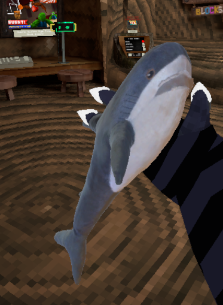

# 🦈 Little Shark Holdable

A simple Gorilla Tag mod that adds a small custom shark holdable to the game.

## Preview

## Features

- Small custom shark holdable
- Lightweight and simple
- Easy to install

## Installation

1. Download the latest release.
2. Drag the mod into your Gorilla Tag `BepInEx/plugins` folder.
3. Launch the game.
4. Enjoy your new shark!

## Notes

This is a client-side cosmetic mod and is made for fun. It doesn't affect gameplay or give any advantages.
However I am considering adding networking so others with the mod can see it!

## Credits

- Model & mod: **Pasta (me)**

## Issues

If you find any bugs or have suggestions, feel free to open an issue or get in touch (@pastapluh on discord).

---

Have fun! 🦈

**Gorilla Tag** and all related names, logos, assets, and trademarks are the property of **Another Axiom LLC**. This mod is distributed for personal, non-commercial use only. If requested by the rights holders, this project or any of its assets will be modified or removed.
